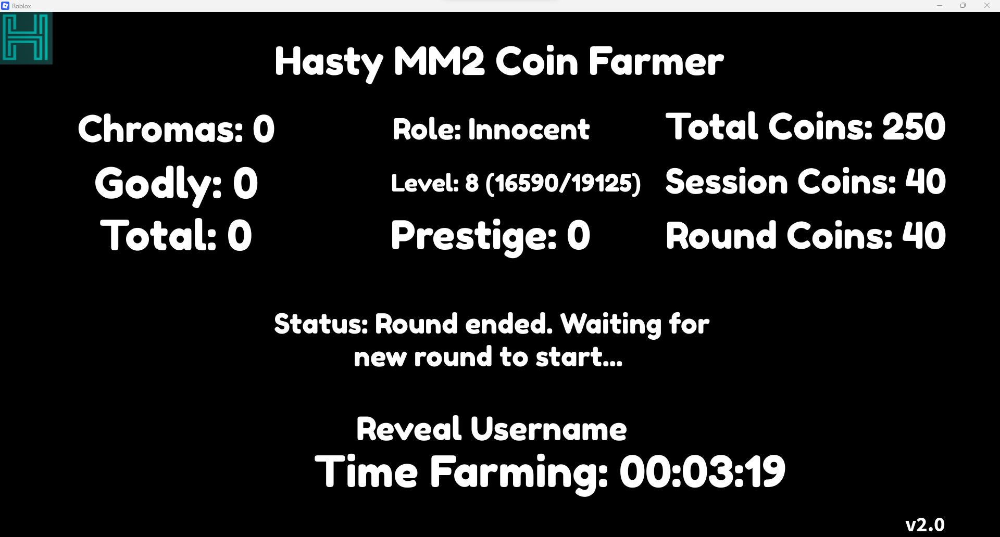
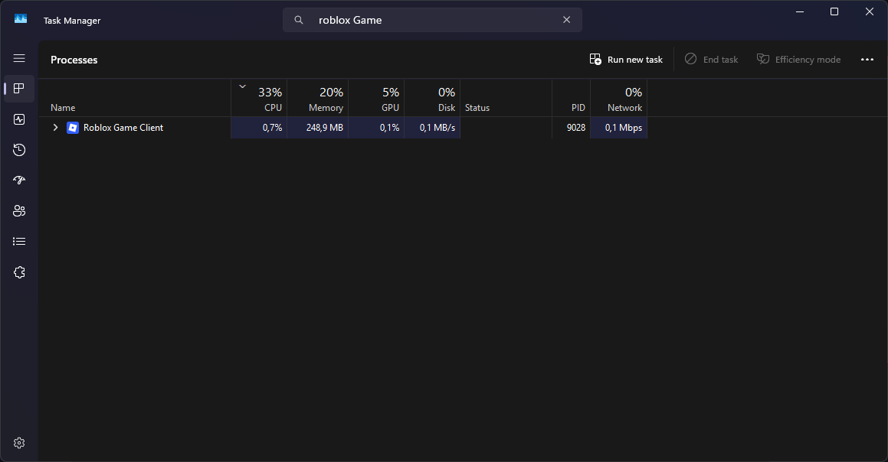

# MM2 Coin Farmer Script

A simple but powerful **coin farming script** for **MM2** .  
No UI, just pure performance — configured through code and optimized for **low CPU usage**.

---

## 🔧 Features

- ✅ Automatic coin farming
- 💤 Built-in Anti-AFK
- ⚙️ Fully configurable behavior
- 🔁 Auto-rejoin after rounds
- 💾 Extremely low CPU usage
- 🛠️ No GUI — runs fully through config

---

## 🚀 How to Use

1. Open Roblox and join **Murder Mystery 2**
2. Open your executor (e.g. AWP, Delta, KRNL)
3. Copy the script from the Script Example
4. Customize your config at the top
5. Execute it — done!


## 🖼️ UI Screenshot



## 📁 Script Example

Simply paste the full script into your executor. You can adjust the config at the top:

```lua
getgenv().Config = {
	--["Script_Key"] = "",
	["CPU Saver"] = true,
	["Coin Farm Mode"] = 2,

	["Auto Open"] = {
		["Enabled"] = false,
		["Crate"] = "MysteryBox2",
	},

	["Webhook"] = {
		["URL"] = "",
		["UserID"] = "",
	},

	["Other"] = {
		["Auto Prestige"] = true,
		["Auto Restart on Update"] = false,
		["Auto Craft"] = false, -- not implemented yet
	},
}

loadstring(game:HttpGet("https://raw.githubusercontent.com/Paule1248/mm2/refs/heads/main/script.lua"))()
```

## 🖥️CPU Usage
Extremely low CPU consumption is a key feature of this script:


> **Note:** CPU: AMD Ryzen 5 5600, Memory: 64GB (I used Mem Reduct to reduce memory usage), GPU: GTX 1660 Ti


## 📘 Configuration Docs

### 🧠 Coin Farm Mode

Select how the bot collects coins:

| Mode | Description                                               | Recommended Use                   |
|------|-----------------------------------------------------------|-----------------------------------|
| `1`  | Makes you go under the map so no one will ever see you    | Single account / low risk farming |
| `2`  | Fast & efficient, but more obvious behavior               | Alt accounts / fast farming       |

---

### 🎁 Auto Open → `Crate`

If auto open is enabled, the script will open crates using collected coins.  
Set the crate name exactly as listed below:

**Available crate names:**

- `MysteryBox1`
- `MysteryBox2`
- `KnifeBox1`
- `KnifeBox2`
- `KnifeBox3`
- `KnifeBox4`
- `KnifeBox5`
- `GunBox1`
- `GunBox2`
- `GunBox3`

> Make sure `["Auto Open"]["Enabled"] = true` to use this feature.

---


### 📡 Webhook Configuration

Use Discord webhooks to get notifications when crates are opened or when you pull rare items like Godly or Chroma.

| Key       | Description                                                                |
|-----------|----------------------------------------------------------------------------|
| `URL`     | Your Discord webhook URL. Sends updates when crates are opened.           |
| `UserID`  | Your Roblox User ID. You get notified (pinged) when you pull Godly or Chroma items. |

#### Example

```lua
["Webhook"] = {
    ["URL"] = "https://discord.com/api/webhooks/your_webhook_url_here",
    ["UserID"] = "1234567890",
},
```

### ⚙️ Other Settings

| Option                   | Description                              |
|--------------------------|------------------------------------------|
| `Auto Prestige`          | Automatically prestige when possible     |
| `Auto Restart on Update` | Reload script if it updates (optional)   |
| `Auto Craft`             | Not implemented yet (reserved for future)|

---

## ⚠️ Disclaimer

This script is for **educational purposes only**.  
Using scripts in Roblox can violate their Terms of Service and may result in a ban.  
You use this software **at your own risk**.

---

## 📄 License

MIT License – see [`LICENSE`](./LICENSE) for more information.
